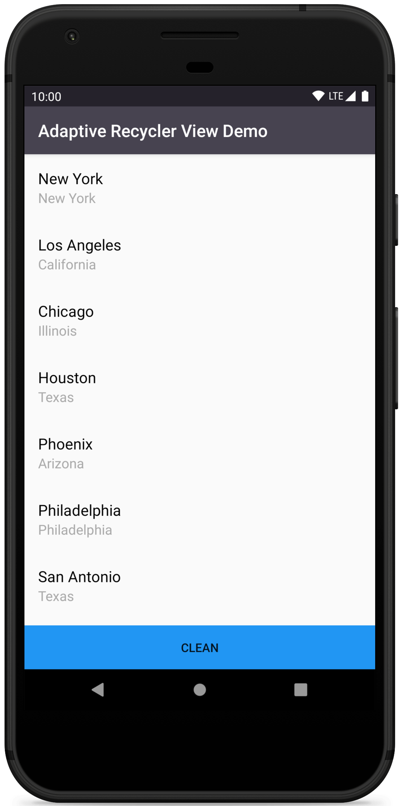

Adaptive Recycler View
=============

[](https://travis-ci.org/fartem/adaptive-recycler-view)
[](https://codebeat.co/projects/github-com-fartem-adaptive-recycler-view-master)
[](https://codecov.io/gh/fartem/adaptive-recycler-view)
[](https://hitsofcode.com/view/github/fartem/adaptive-recycler-view)
[](https://android-arsenal.com/details/1/8036)
[ ](https://bintray.com/fartem/android/com.smlnskgmail.jaman.adaptiverecyclerview/0.1.2/link)

About
-------------

Library for creating RecyclerView with warning message of data availability.

Screenshots
-------------

First screenshot - example of app state with an empty list of data.
Second screenshot - example of app state with loaded items in RecyclerView.

<br/>
<p align="center">
  
  
</p>

Usage
-------------

### Gradle dependency

In root `build.gradle`:

```gradle
allprojects {
    repositories {
        ...
        maven {
            url 'https://dl.bintray.com/fartem/android'
        }
    }
}
```

In project level `build.gradle`:

```gradle
implementation 'com.smlnskgmail.jaman:adaptiverecyclerview:version'
```

### AdaptiveRecyclerView

#### XML

```xml
<com.smlnskgmail.jaman.adaptiverecyclerview.AdaptiveRecyclerView
        android:layout_width="match_parent"
        android:layout_height="match_parent"
        app:layoutManager="androidx.recyclerview.widget.LinearLayoutManager" />
```

#### Code

Java
```java
adaptiveRecyclerView.setMessageView(adaptiveMessageView);
```

Kotlin
```kotlin
adaptive_recycler_view.messageView = adaptive_message_view
```

__Methods__

| Method | Arguments | Description |
| --- | --- | --- |
| setMessageView | messageView: View | Set message view |

### AdaptiveMessageView

#### XML

Must be declared in layout with AdaptiveRecyclerView.

```xml
<com.smlnskgmail.jaman.adaptiverecyclerview.AdaptiveMessageView
        android:layout_width="match_parent"
        android:layout_height="match_parent"
        arv:message_image="@drawable/ic_error"
        arv:message_image_tint="@color/colorPrimary"
        arv:message_text="@string/text_message_list"
        arv:message_text_size="@dimen/medium_text"
        arv:message_text_color="@color/colorPrimary" />
```

__Parameters__

| Parameter | Description |
| --- | --- |
| `message_image` | Set custom image |
| `message_image_tint` | Set tint for image (default or custom) |
| `message_text` | Set message text |
| `message_text_size` | Set message size |
| `message_text_color` | Set message text color |
| `message_text_at_center` | Set message TextView gravity at `Gravity.CENTER` |

__Dimension__

| Dimension | Description |
| --- | --- |
| `adaptive_message_view_text_margin_top` | Distance between image and message |
| `adaptive_message_view_text_padding` | Message padding |
| `adaptive_message_view_image_size` | Image size |
| `adaptive_message_view_text_size` | Message text size |

__Strings keys__

| String key | Description |
| --- | --- |
| `adaptive_message_view_text` | Message text |
| `adaptive_message_view_content_description` | Image content description |

Demo
-------------


How to contribute
-------------

Read [Commit Convention](https://github.com/fartem/repository-rules/blob/master/commit-convention/COMMIT_CONVENTION.md). Make sure your build is green before you contribute your pull request. Then:

```shell
gradlew clean
gradlew build
```

If you don't see any error messages, submit your pull request.

Contributors
-------------

* [@fartem](https://github.com/fartem) as Artem Fomchenkov